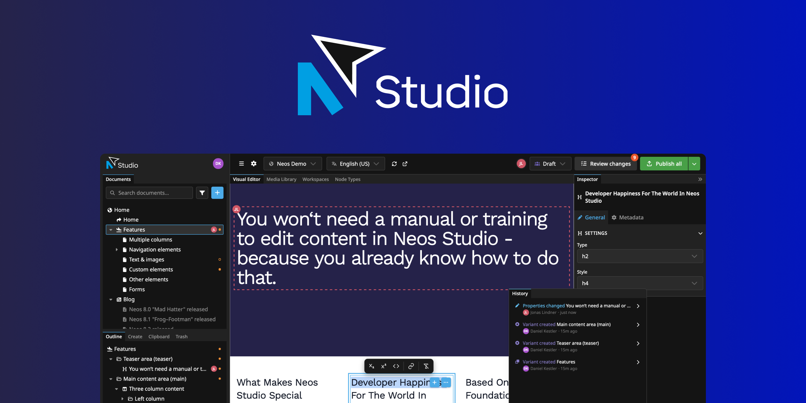

# Neos Studio



**A revolutionary, blazingly fast editing UI for Neos 9.** Built from scratch on a clean HTTP API — zero coupling to the legacy `Neos.Neos.Ui`, zero legacy baggage. This is what content editing in Neos can feel like: instant, fluid, and open for extension from day one.

Neos Studio is a modern single-page application (Vite + React + TypeScript + TanStack Query + Tailwind CSS v4) that talks to Neos exclusively through [Medienreaktor.NeosApi](https://github.com/medienreaktor/Medienreaktor.NeosApi) — a unified OAuth-secured REST API over the Event-Sourced Content Repository. No Fusion-rendered backend modules, no shared React runtime with the old UI, no wire-protocol archaeology. Just a fast, typed, cache-smart client in front of a well-defined API.

> **Why "the future"?** The classic Neos UI is a great piece of engineering — from 2016. Its plugin API freezes React 16 forever, its wire protocol is undocumented, and every extension fights the build system. Neos Studio inverts that: an API-first backend, a lean modern frontend, and extensibility through observable registries designed as a public contract. It replaces legacy UI surfaces one at a time — the strangler pattern, applied to the editing experience itself.

## Highlights

### ⚡ Blazingly fast, everywhere

- **Instant loads** — a static Vite-built SPA served at `/neos/studio`, with TanStack Query caching and background revalidation. Navigating between documents doesn't reload the world; it reuses what's already in the cache.
- **Silent auth** — Studio provisions its own first-party OAuth client (authorization code + PKCE) on first load. Logged-in backend users get a token silently: no consent screen, no setup, and automatic client-side token refresh.
- **Lazy everything** — document tree and content outliner load on demand, honoring the Neos `loadingDepth` settings, with node type icons, visibility states and pending-change markers.

### 🧩 Dockable panel system

The entire workspace is built from **panels**: document tree, content outliner, inspector, media browser, node creation, clipboard, preview — every surface is a panel that can be docked, resized and toggled. Panels live in a `PanelRegistry`, which means third-party packages register their own panels into the same layout system the built-in ones use. Your panel is a first-class citizen, not an iframe in a corner.

### ✍️ Lightweight inline Rich Text Editing

Inline editing runs on **TipTap 3** — a lean, headless, ProseMirror-based editor instead of a monolithic CKEditor build. The RTE lives _inside the preview iframe_ with a floating toolbar, driven by a guest-side formatting registry, so what you edit is exactly what renders. The same normalized formatting engine powers the inspector's rich-text editor, and the shared Link Editor (with a pluggable tab registry) handles links in both the RTE and the inspector's link fields.

### 🖱️ Context menus and drag & drop

- **Context menus** on every node — in the document tree, the content outliner and the media browser — with copy, cut, paste, delete, hide and more.
- **Drag & drop node moves** in the trees, constraint-aware.
- **Drag-to-create**: pick a node type from the creation panel and drop it straight into the live preview, or use the insert dialog (before / inside / after, filtered by node type constraints).
- A **node clipboard** that survives navigation, with its own panel and document/content separation.

### 🔍 A complete, extensible inspector

Full parity with the classic inspector — and then some:

- **Editors**: text, textarea, rich text, select box (with data source support), references, asset / assets, image, link, date & time, range slider, boolean, code, node type, URI path segment … all registered through an editor registry, all replaceable.
- **Views**: NodeInfo, Column, Table and TimeSeries views plus data-source-driven widgets — through a views registry.
- **Validators**: the `Neos.Neos/Validation` built-ins with live inline errors, tab badges and save-blocking — through a validators registry.
- **ClientEval** support (`ClientEval:` expressions for hidden state and editor options), transient values, and **dimension shine-through indicators** with one-click "create variant" — in the inspector _and_ directly in the preview.

### 🌐 Full editing environment

- **Live preview** with an inline-editing guest bridge — edit content directly in the rendered page.
- **Media module**: full asset management plus picker mode for asset editors.
- **Workspaces, sites and dimensions**: switchers for all three, pending-change tracking, publish and discard.
- **User & profile management**: administer users, and every editor gets self-service profile settings (name, email, password, interface language).
- **Localized UI** in English and German via Neos' own XLIFF infrastructure (450+ keys) — translated the Neos way, extendable the Neos way.
- **Consistent design system**: shadcn-style components on [Base UI](https://base-ui.com) primitives, themed with the official Neos UI palette. Dark, focused, familiar.

### 🔌 Extensible by design — registries all the way down

Extensibility isn't bolted on; it's the architecture. Studio's building blocks are **observable registries**:

| Registry          | What you can add                                   |
| ----------------- | -------------------------------------------------- |
| Panels            | Whole new workspace surfaces, docked anywhere      |
| Inspector editors | Custom property editors for any node type property |
| Inspector views   | Custom read-only views and widgets                 |
| Validators        | Custom client-side validation                      |
| Link editor tabs  | New link source types in the shared link modal     |
| Modals            | App-level dialogs                                  |

Third-party packages ship a small IIFE bundle that binds to the shell's public plugin API (`window.NeosStudio` — React instance, `useStudio()` app state, and all registries) with full TypeScript types generated from the shell's own source. The shell injects your bundle via a single `Settings.yaml` entry — no build-system fusion, no webpack surgery, no version lock-in dance. Registration is late-bindable and observable: register, and the UI re-renders.

**Start here:** [Medienreaktor.NeosStudio.ExamplePlugins](https://github.com/medienreaktor/Medienreaktor.NeosStudio.ExamplePlugins) — a copy-me boilerplate that registers an example panel and a custom inspector editor (a color picker) from a completely separate package.

## The package family

| Package                                                                               | What it is                                                                                                                                                                                                                                                                                                                                                                                                       |
| ------------------------------------------------------------------------------------- | ---------------------------------------------------------------------------------------------------------------------------------------------------------------------------------------------------------------------------------------------------------------------------------------------------------------------------------------------------------------------------------------------------------------- |
| [Medienreaktor.NeosApi](https://github.com/medienreaktor/Medienreaktor.NeosApi)                                     | The foundation: OAuth 2.1 (PKCE, refresh token rotation, client credentials, dynamic registration), a read API over the ContentGraph, a write API for CR commands with batching and idempotency, workspace publishing, media API, data sources. Deny-by-default endpoint policy, structural content authorization through the CR itself. Useful far beyond Studio — for integrations, importers and MCP servers. |
| **Medienreaktor.NeosStudio** (this package)                                           | The editing UI built on that API.                                                                                                                                                                                                                                                                                                                                                                                |
| [Medienreaktor.NeosStudio.ExamplePlugins](https://github.com/medienreaktor/Medienreaktor.NeosStudio.ExamplePlugins) | Plugin boilerplate: example panel + example inspector editor, with the full build setup for extending Studio from your own package.                                                                                                                                                                                                                                                                              |

## Getting started

Requires Neos `^9.1`, PHP `^8.2` and Node 22 (pinned via `.nvmrc`) for building the frontend.

```sh
composer require medienreaktor/neos-api medienreaktor/neos-studio

# build the SPA
cd DistributionPackages/Medienreaktor.NeosStudio/Resources/Private/Studio
nvm use
npm install
npm run build      # outputs to Resources/Public/Studio/ (committed to the repo)

# publish and flush on the Neos side
./flow resource:publish
./flow flow:cache:flush
```

Open `/neos/studio` and log in with your Neos backend account. That's it — Studio lazily provisions its own OAuth client on first load; there is nothing to configure.

## Development

The SPA sources live in `Resources/Private/Studio/` (Vite, `src/`, `index.html`); the build output goes to `Resources/Public/Studio/`.

```
src/
  main.tsx              entry: installs plugin-API globals, mounts the app
  app/                  application shell, providers, shared QueryClient
  auth/                 authorization-code + PKCE flow, token refresh
  api/                  data layer: typed apiFetch(), query-key factory, one hook file per resource
  components/ui/        shadcn-style components on Base UI primitives (owned code)
  features/             one folder per feature: tree, inspector, preview, media,
                        panels, creation, clipboard, editing, links, dimensions,
                        workspaces, sites, users, profile, modals
  guest/                the script injected into the preview iframe:
                        inline editing, TipTap RTE, toolbar, link editing
  plugin-api/           the public plugin API surface (window.NeosStudio)
  lib/, hooks/          shared utilities
```

Conventions: every query key comes from `api/keys.ts` (never inline literals); one hook file per API resource; feature folders own their UI and hooks; `@/` aliases `src/`. Styling is Tailwind v4 (CSS-first config) mapped onto the shadcn token contract with the official Neos palette; primitives are Base UI (`@base-ui/react`), not Radix.

`npm run dev` starts the Vite dev server for fast iteration; end-to-end auth is tested against the built-and-served shell at `/neos/studio` (the OAuth redirect URIs are bound to that origin).

## Status & roadmap

Studio is a working editing environment today: silent auth, trees and outliner, full inspector (editors, views, validators, ClientEval, dimensions), inline rich-text editing, media module, node creation and clipboard with drag & drop, context menus, user and profile management, a localized UI and a public plugin API — verified end-to-end against a ddev Neos 9 site with automated smoke tests.

Next up: collaborative editing on shared workspaces (change feed, presence), richer publishing views, and continuing to replace legacy `Neos.Neos.Ui` surfaces one at a time.

## License

Neos Studio is free software, released under the [GNU General Public License, version 3 or later](LICENSE).

Copyright (C) 2026 medienreaktor GmbH

---

Built by [medienreaktor](https://www.medienreaktor.de) with ❤️ for the Neos community. Feedback, issues and plugin experiments very welcome — this is where the Neos editing experience is headed. Come shape it.
